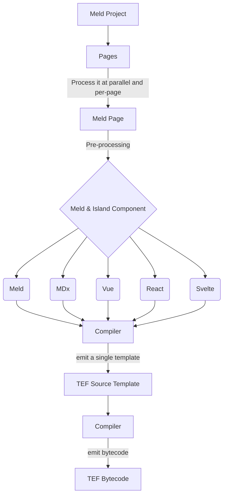
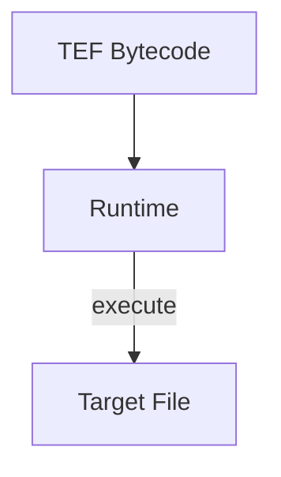

# Meld Architecture

Meld spesification is should by compiler and mostly used as a pre-processing features.

TEF specification is used by compiler to emit a correct bytecode and used by runtime to correctly implement the flow of the runtime.

When we talking about Meld specification we talking about from Meld Project into TEF Source Template.
And when talking about TEF we talking about transpiled TEF Source Template into TEF Bytecode.

Below is how we execute from TEF Bytecode into a target file and it's use TEF spec.

